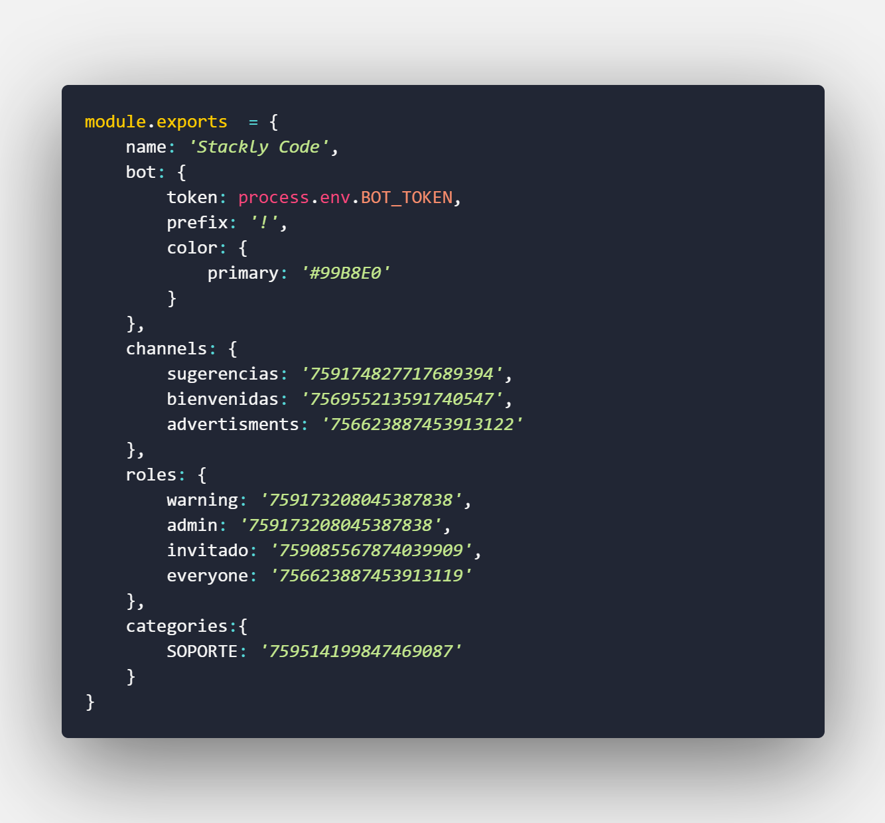

# Discord Stackly Code Bot

## Commands
****

### prefix : $
 

suggestions: prefix + sugerencia + YOUR_SUGGESTION

advert: prefix + advert + YOUR_ADVERT (**just for admins**)

kick: prefix + kick + USER_KICKED

ban: prefix + ban + USER_BANED

warn: prefix + warn + USER_WARNED

---

**only works in Stackly Code discord server**

**for moderation commands you must need admin role in Stackly Code discord server**

If you want to use Stackly Code discord bot code for your own you must follow this instructions
---
 

- you must change roles id and channels id in config.js for your own ones

- you must set a .env file in root and there write BOT_TOKEN=YOUR_TOKEN