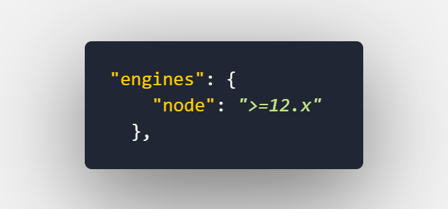

# Discord Stackly Code Bot

## Commands
****

### prefix : $
<br/>

help: prefix + help (**the asnwer will depend of your permission roles**)

suggestions: prefix + sugerencia + YOUR_SUGGESTION

advert: prefix + advert + YOUR_ADVERT ( **just for admins** )

clear: prefix + clear + NUMBER_OF_MESSAGES_TO_CLEAR ( **just for admins** )

kick: prefix + kick + USER_KICKED

ban: prefix + ban + USER_BANED

warn: prefix + warn + USER_WARNED

### exaple : `$clear 5`

---


**for moderation commands you must need admin role**

---

## If you want to use Stackly Code discord bot code for your own you must follow this instructions

<br/>

- First fork this project, then git clone your fork and open in your text editor or ide

- You must have node installed as minimum version 12.



- Run command ```$ npm install``` or ```$ npm i``` to install all dependencies.

- You must change roles id and channels id in config.js for your own ones


- You must set a .env file in root and there write BOT_TOKEN=YOUR_TOKEN

- Run Command ```$ npm run dev``` to run bot in your local
